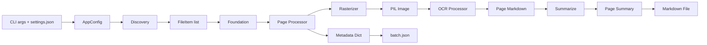

# md_gen Developer Guide

This document explains how the `src/md_gen` module converts PDFs and images into Markdown using local OCR, and how a new developer should reason about its code.

---

## 1. Overview & System Flow

`md_gen` is the ingestion half of `dir2md`. It takes a directory of source files (PDFs and images), runs OCR on each page, summarizes the extracted text, and writes:

- one Markdown file per source file, and
- a single `batch.json` describing the entire run.

The module is intentionally local-first: all model calls go through the shared gateway in `src/common/gateway.py`, and no intermediate images are persisted.

### Data lifecycle



### Per-item tile workflow

Earlier versions of the pipeline ran each stage across the whole batch (rasterize all, OCR all, summarize all). The current design processes one file completely before moving to the next:

1. **Discover** supported files in the source directory.
2. For each file, **rasterize/resize** one page at a time.
3. Run **OCR** on that page image.
4. Generate a **page summary**.
5. Append the page Markdown to the per-file document.
6. After the last page, combine page summaries into a **document summary**.
7. Write the Markdown file and return metadata.
8. After all files, write `batch.json`.

This keeps memory bounded (only one page image is in memory at a time) and lets `md_mrg` receive finished Markdown documents immediately.

---

## 2. Logical Architecture (Functional Modules)

Each file under `src/md_gen/` owns a single responsibility. The table below maps files to their contracts.

| File | Responsibility | Primary Input | Primary Output |
|------|---------------|---------------|----------------|
| [src/md_gen/cli.py](src/md_gen/cli.py) | Parse arguments, build `AppConfig`, dispatch `foundation`. | `sys.argv` | exit code |
| [src/md_gen/config.py](src/md_gen/config.py) | Load `data/config/settings.json`, apply CLI overrides, validate paths, assemble immutable `AppConfig`. | `SimpleNamespace` args + JSON settings | `AppConfig` |
| [src/md_gen/discovery.py](src/md_gen/discovery.py) | Scan the top-level source directory, filter supported extensions case-insensitively, and order files naturally. | `AppConfig` | `tuple[FileItem, ...]` |
| [src/md_gen/rasterizer.py](src/md_gen/rasterizer.py) | Return a single resized `PIL.Image.Image` for a PDF page or an image file; also expose PDF page count. | `Path`, `max_edge_size`, optional page number | `PIL.Image.Image` or `int` |
| [src/md_gen/ocr_processor.py](src/md_gen/ocr_processor.py) | Pure image-to-text service via `LlamaOcrGateway`. | `AppConfig`, `PIL.Image.Image` | Markdown `str` |
| [src/md_gen/summarize.py](src/md_gen/summarize.py) | Generate page summaries and a final document summary from collected page summaries. | `AppConfig`, `str` or `list[str]` | Summary `str` |
| [src/md_gen/page_processor.py](src/md_gen/page_processor.py) | Process one file end-to-end: rasterize/resize each page, OCR, summarize, write Markdown, return metadata. | `AppConfig`, `FileItem` | `dict[str, Any]` |
| [src/md_gen/foundation.py](src/md_gen/foundation.py) | Orchestrate the batch: iterate over `FileItem`s, invoke `page_processor`, collect metadata, write `batch.json`. | `AppConfig` | exit code |

### Key data contracts

- `FileItem` ([src/md_gen/discovery.py](src/md_gen/discovery.py)):
  - `source_path`: resolved `Path`
  - `source_type`: `"pdf"` or `"image"`
  - `order_index`: zero-based position in discovery order
  - `ordering_key`: natural-sort tuple used for deterministic ordering

- Metadata dict returned by `page_processor.process_file`:
  - `source_file_name`: original file name
  - `file_type`: `"pdf"` or `"image"`
  - `page_count`: number of pages processed
  - `date_of_process`: ISO 8601 UTC timestamp
  - `summary`: document-level summary
  - `markdown_file`: output Markdown file name
  - `status`: `"ok"` or `"failed"`

- `batch.json` shape:

  ```json
  {
    "documents": [
      { /* metadata dict */ },
      { /* metadata dict */ }
    ]
  }
  ```

---

## 3. Design Patterns & Testability

### Functional, side-effect-isolated design

`md_gen` favors small, mostly pure functions:

- **Configuration is assembled once.** `AppConfig` is an immutable dataclass. CLI arguments override `data/config/settings.json`, which is created from defaults if missing.
- **Core transforms are pure.** `rasterizer.resize_image`, `summarize.summarize_page`, and `ocr_processor.extract_markdown` do not mutate global state.
- **I/O is pushed to the edges.** File system writes happen in `page_processor.py` (Markdown output) and `foundation.py` (`batch.json`). Model calls are isolated behind the gateways in `src/common/gateway.py`.
- **Failure is contained per file.** `page_processor.process_file` catches exceptions, prints an error, writes any partial Markdown, marks the metadata status as `failed`, and returns so the batch can continue.

### Testing strategy

- **Mock the gateways.** Both `LlamaOcrGateway` and `LlamaLanguageGateway` accept an optional `httpx.Client`, making it easy to inject deterministic responses in tests.
- **Prefer in-memory images.** Use small synthetic `PIL.Image.Image` objects rather than real PDFs for unit tests of OCR and summarization boundaries.
- **Test ordering and edge cases explicitly.** Discovery tests cover natural sort (`file2.pdf` before `file10.pdf`), case-insensitive extensions, and subdirectory skipping.
- **Keep integration tests focused.** End-to-end CLI tests use fixture PDFs/images and verify the output directory contains exactly N Markdown files plus `batch.json`.

### Best-practice note for contributors

When adding new code to `md_gen`:

1. Put each transformation in the smallest reasonable function.
2. Keep functions pure where possible; if a function performs I/O or calls a model, make that obvious from its name and signature.
3. Inject dependencies (gateways, clients, config) rather than reading globals.
4. Add a unit test for the new boundary before adding an integration test.
5. Do not duplicate OCR, summarization, or normalization logic that belongs in `md_mrg`.

---

## 4. OCR Module Integration (from Issue #15)

Issue #15 refactored the legacy batch-stage pipeline into the per-item tile workflow described above. The specific architectural choices are:

### 4.1 Merged rasterize/resize module

`rasterizer.py` and `resizer.py` were merged into a single [src/md_gen/rasterizer.py](src/md_gen/rasterizer.py). It exposes:

- `rasterize_page(source_path, max_edge_size, page_number=None) -> PIL.Image.Image`
- `get_pdf_page_count(source_path) -> int`

For PDFs, only the requested page is rendered and the document is closed immediately to keep memory usage bounded. For images, the page index is ignored and the image is resized directly after EXIF orientation correction.

### 4.2 Pure image-to-text OCR processor

[src/md_gen/ocr_processor.py](src/md_gen/ocr_processor.py) now contains only `extract_markdown(config, image)`. It encodes the image in memory and calls `LlamaOcrGateway`. It performs no file I/O and no summarization.

### 4.3 Dedicated summarization module

A new [src/md_gen/summarize.py](src/md_gen/summarize.py) owns both page-level and document-level summaries:

- `summarize_page(config, page_markdown) -> str`
- `summarize_document(config, page_summaries) -> str`

The document summary is built from page summaries, not the full OCR text. If a file has only one page, the document summary equals the single page summary. Empty OCR results yield an empty summary deterministically.

### 4.4 Per-file page processor

[src/md_gen/page_processor.py](src/md_gen/page_processor.py) replaces the old `markdown_writer.py` and `metadata_writer.py`. It:

- computes the output path as `{source_stem}.md`,
- loops through pages,
- calls rasterizer → OCR → summarize in order,
- prints `page n done` after each page,
- writes the Markdown file,
- returns a metadata dict.

On failure it prints the error, writes partial Markdown, and returns the dict with `status=failed`.

### 4.5 Foundation as per-item orchestrator

[src/md_gen/foundation.py](src/md_gen/foundation.py) iterates over the sorted `FileItem` list, calls `page_processor.process_file` for each, collects metadata dicts, and writes `batch.json`. It preserves existing exit codes:

- `2` for configuration validation errors
- `4` for gateway errors
- `1` for unexpected runtime errors
- `0` on success

### 4.6 Output contract

After a run with N input files, the output directory contains exactly:

- N Markdown files (`{source_stem}.md`), and
- one `batch.json`.

No resized or rasterized image files are written.

---

## 5. Running Tests and the CLI

All commands below assume the project environment is active (managed with `uv`).

### Run the full test suite with coverage

```bash
uv run pytest
```

`pyproject.toml` configures pytest with `--cov=md_gen --cov-report=term-missing --cov-fail-under=80`.

### Run only `md_gen` tests

```bash
uv run pytest test/md_gen
```

### Run a single test file

```bash
uv run pytest test/md_gen/test_page_processor.py -v
```

### Run the CLI against a source directory

```bash
uv run md-gen \
  --source ./fixtures/scanned-docs \
  --output ./out/md-gen-run \
  --ocr-model-endpoint http://127.0.0.1:8080/v1/chat/completions \
  --ocr-model-name lightonocr-2 \
  --language-model-endpoint http://127.0.0.1:8081/v1/chat/completions \
  --language-model-name qwen3-1.7b
```

You can also rely on values in `data/config/settings.json`; CLI arguments override them. The first run will create `data/config/settings.json` from `data/config/settings-default.json` if it does not exist.

### Useful CLI flags

| Flag | Purpose |
|------|---------|
| `--source` | Required. Source directory containing top-level PDF/image files. |
| `--output` | Required. Output directory root. |
| `--summary-prompt` | Optional path to a custom summary system prompt. |
| `--ocr-model-endpoint`, `--ocr-model-name`, `--ocr-timeout-seconds`, `--ocr-max-retries` | OCR gateway overrides. |
| `--language-model-endpoint`, `--language-model-name`, `--language-timeout-seconds`, `--language-max-retries` | Language gateway overrides. |
| `--max-longest-edge-px` | Resize longest edge bound. |
| `--token-threshold` | Token budget hint for downstream processing. |
| `--overwrite` | Overwrite existing Markdown files. |
| `--dry-run` | Prepare config without processing (behavior depends on implementation). |

---

## Quick Reference

- Entry point: [src/md_gen/cli.py](src/md_gen/cli.py)
- Configuration: [src/md_gen/config.py](src/md_gen/config.py)
- Discovery & ordering: [src/md_gen/discovery.py](src/md_gen/discovery.py)
- Image preparation: [src/md_gen/rasterizer.py](src/md_gen/rasterizer.py)
- OCR: [src/md_gen/ocr_processor.py](src/md_gen/ocr_processor.py)
- Summarization: [src/md_gen/summarize.py](src/md_gen/summarize.py)
- Per-file processing: [src/md_gen/page_processor.py](src/md_gen/page_processor.py)
- Batch orchestration: [src/md_gen/foundation.py](src/md_gen/foundation.py)

